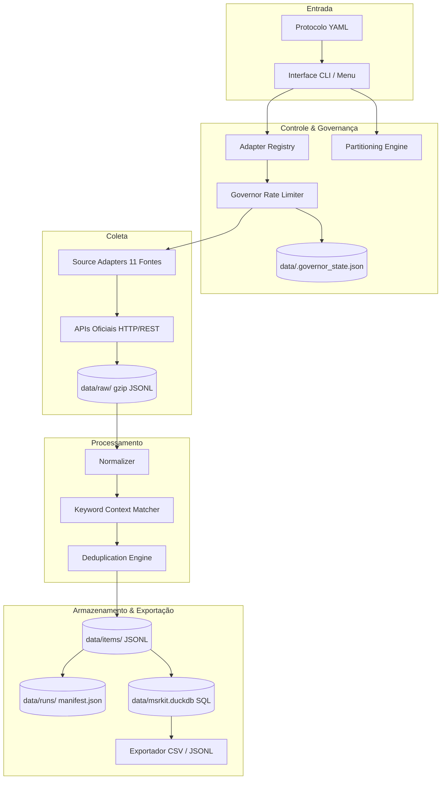

# Manual Completo e Documentação Técnica do MSR-Kit

> **MSR-Kit: Mining grey literature through official APIs for empirical software engineering research.**  
> *Versão do Software: 0.1.0 | Licença: Apache 2.0*

---

## 📑 Sumário Executivo

1. [Visão Geral e Contexto Científico](#1-visão-geral-e-contexto-científico)
2. [Arquitetura do Sistema e Componentes Internos](#2-arquitetura-do-sistema-e-componentes-internos)
3. [Instalação e Modos de Execução](#3-instalação-e-modos-de-execução)
4. [Guia do Menu Interativo (`msrkit menu`)](#4-guia-do-menu-interativo-msrkit-menu)
5. [Referência Completa de Comandos da CLI](#5-referência-completa-de-comandos-da-cli)
6. [Contrato Científico: Protocolo YAML](#6-contrato-científico-protocolo-yaml)
7. [Matriz Detalhada de Fontes e Credenciais](#7-matriz-detalhada-de-fontes-e-credenciais)
8. [Estrutura de Armazenamento e Esquema dos Dados](#8-estrutura-de-armazenamento-e-esquema-dos-dados)
9. [Desduplicação e Processamento de Texto](#9-desduplicação-e-processamento-de-texto)
10. [Políticas Éticas e Termos de Uso (Redistribuição)](#10-políticas-éticas-e-termos-de-uso-redistribuição)
11. [Guia de Desenvolvimento, Testes e Extensão](#11-guia-de-desenvolvimento-testes-e-extensão)

---

## 1. Visão Geral e Contexto Científico

O **MSR-Kit** é uma infraestrutura de software de alta confiabilidade desenvolvida para viabilizar **Estudos de Engenharia de Software Empírica (MSR/SLR)** baseados em **literatura cinza** (*grey literature*: discussões técnicas, postagens em blogs de engenharia, repositórios de código aberto, perguntas em fóruns especializados e feeds de pesquisa).

### 🎯 Pesquisa Alvo
A ferramenta foi projetada para responder a 5 Questões de Pesquisa (Research Questions - RQs) focadas em **ferramentas e métodos de teste para sistemas baseados em LLMs com RAG e Agentes Autônomos**:
- **RQ1 (Ferramentas em RAG e Níveis de Evidência):** Catalogação de ferramentas de teste para RAG e classificação de evidência (N1: anedótico, N2: implementação open-source demonstrada, N3: benchmark empírico formal).
- **RQ2 (Métodos e Oráculos em RAG):** Identificação de técnicas de teste (ex: datasets sintéticos, testes metamórficos, oráculos LLM-as-a-judge vs. asserções determinísticas).
- **RQ3 (Ferramentas em Sistemas Agênticos):** Catalogação de frameworks de teste e observabilidade para agentes autônomos e arquiteturas multiagente.
- **RQ4 (Falhas e Métodos em Agentes):** Mapeamento de falhas típicas (deriva de objetivo, loops infinitos de ferramentas, envenenamento de memória, impasses de coordenação) e suas abordagens de validação.
- **RQ5 (Transferibilidade e Novas Dimensões):** Comparação entre técnicas transferíveis de RAG para Agentes versus dimensões genuinamente novas em agentes (espaços de ação não determinísticos, trajetórias multi-turn).

### 🛡️ Princípios Fundamentais
1. **Exclusividade de APIs Oficiais:** Não é realizado web scraping, parsing de HTML não autorizado ou simulação de navegadores (headless). Toda a comunicação ocorre estritamente por endpoints oficiais.
2. **Princípio do Conservadorismo (§20.4):** Diante de qualquer ambiguidade de rede ou plataforma, o sistema adota a postura que faz menos requisições, retém menos dados e falha o mais cedo possível (*fail-fast*).
3. **Reprodutibilidade e Rastreabilidade Absoluta:** Toda coleta registra parâmetros exatos, hashes criptográficos SHA-256 de requisições e respostas, gerando manifestos imutáveis.

---

## 2. Arquitetura do Sistema e Componentes Internos

O fluxo de dados do MSR-Kit foi desenhado para garantir isolamento em camadas, determinismo e tolerância a falhas.



### Detalhamento dos Componentes Principais:

#### 1. Governor (`src/msrkit/governor.py`) — ADR-001 & ADR-002
- **Token Bucket Proativo:** Bloqueia chamadas *antes* do envio do pacote HTTP (`acquire()`), respeitando a frequência máxima cadastrada na política de cada fonte.
- **Persistência de Quota Diária em Disco:** Salva o volume de requisições do dia em `data/.governor_state.json`. Ao reiniciar a aplicação ou rodar via containers, a contagem diária não é zerada, impedindo o banimento por estouro de cota (ex: limite de 300 req/dia do Stack Exchange sem token).
- **Backoff Reativo:** Inspeciona cabeçalhos `Retry-After`, `x-ratelimit-remaining`, `x-ratelimit-reset` e diretivas `backoff` do Stack Exchange, congelando as requisições pelo tempo determinado pelo servidor remoto.

#### 2. Partitioning Engine (`src/msrkit/partition.py`) — ADR-003
- **Divisão Temporal Binária:** Contorna o limite rígido de 1.000 resultados da API do GitHub. Se uma consulta preliminar (`estimate()`) indica mais de 1.000 itens, o intervalo temporal `[since, until]` é dividido recursivamente pela metade.
- **Eixos Secundários de Partição:** Se um intervalo de 1 dia ainda exceder 1.000 itens, a partição é refinada por linguagens de programação e faixas de estrelas (`stars:a..b`). Caso atinja o limite indivisível, registra `truncated: true` no manifesto científico.

#### 3. BaseAdapter & Registry (`src/msrkit/adapters/`)
- Todos os adaptadores herdam de `BaseAdapter` (`src/msrkit/adapters/base.py`), que provê cliente `httpx` pré-configurado, tratamento de timeouts, cálculo automático de SHA-256 de payloads e retentativas com jitter exponencial (`tenacity`).
- Descoberta dinâmica através de `src/msrkit/registry.py`.

#### 4. Keyword Matcher (`src/msrkit/keywords.py`) — ADR-011
- Realiza busca exata por frases com verificação estrita de fronteiras de palavras (`\b`), insensível a maiúsculas/minúsculas.
- Extrai janelas de contexto de **±40 tokens** ao redor de cada ocorrência do termo nos campos `title`, `body`, `tags` e `path`.

#### 5. Deduplication Engine (`src/msrkit/dedupe.py`) — ADR-012
- **Passo 1 (URL Canônica):** Converte esquema e host para minúsculas, remove parâmetros de rastreamento analítico (`utm_*`, `ref`, `source`) e padroniza barras finais.
- **Passo 2 (Hash de Conteúdo):** Calcula hash SHA-256 sobre a concatenação normalizada de `title + " " + body`.
- Suporta desduplicação da última execução isolada ou de todo o histórico acumulado no corpus.

#### 6. Storage & DuckDB (`src/msrkit/storage.py`)
- **Raw Storage:** Grava respostas brutas das APIs em `data/raw/{source}/{run_id}/{partition_hash}.jsonl.gz` de forma imutável.
- **Items Storage:** Grava itens normalizados em `data/items/{run_id}/items.jsonl` e desduplicados em `items_deduped.jsonl`.
- **DuckDB Layer:** Ingere itens no banco analítico local `data/msrkit.duckdb` (tabela relacional `items`), permitindo queries SQL de alta performance e filtragens complexas.

---

## 3. Instalação e Modos de Execução

Você pode executar o MSR-Kit de duas maneiras: utilizando Docker (totalmente isolado, sem poluir o sistema) ou em ambiente Python local (para desenvolvimento).

### Opção A: Executar com Docker (Recomendado)

O container oficial utiliza **Ubuntu 24.04 LTS (Noble Numbat)** e Python 3.12.

#### 1. Preparação (Apenas na 1ª vez):
No terminal da pasta do projeto, execute:
```bash
# 1. Construir a imagem local:
docker compose build

# 2. Criar o container persistente com mapeamento de volumes:
docker compose create msrkit
```

#### 2. Execução Interativa (Container Único / Mais Rápido):
```bash
docker start -ai msrkit
```
- O terminal conectará instantaneamente no ambiente Linux (`root@...:/app# `).
- Lá dentro, basta rodar o comando desejado sem prefixos:
  ```bash
  msrkit menu
  # ou
  msrkit sources
  # ou
  msrkit run protocols/v0_rag_agents_testing.yaml -s hackernews -l 10
  ```
- Para sair e desligar o container, digite `exit`.

#### 3. Comandos Diretos no Terminal do Host (Windows / PowerShell):
Se não quiser entrar no container e preferir disparar comandos pontuais diretamente do PowerShell ou CMD:
```bash
# Abrir o menu interativo:
docker compose run --rm msrkit msrkit menu

# Rodar coleta com limite:
docker compose run --rm msrkit msrkit run protocols/v0_rag_agents_testing.yaml -s devto -l 10
```

---

### Opção B: Executar com Python Nativo (Ambiente Local)

Requisitos: **Python 3.11+** e Git.

```bash
# 1. Criar ambiente virtual
python -m venv .venv

# 2. Ativar ambiente virtual
.venv\Scripts\activate      # No Windows
source .venv/bin/activate    # No Linux / macOS

# 3. Instalar o projeto em modo editável com dependências completas
pip install -e ".[dev]"
```

Após a instalação, o comando binário `msrkit` estará disponível no seu terminal.

---

## 4. Guia do Menu Interativo (`msrkit menu`)

O menu interativo foi construído com a biblioteca `rich` e foi desenhado para pesquisadores que desejam minerar, gerenciar fontes e exportar dados sem precisar memorizar comandos ou flags de linha de comando.

Para acessar:
- **No container Docker:** `msrkit menu`
- **No Docker pelo host:** `docker compose run --rm msrkit msrkit menu`
- **No Python nativo:** `msrkit menu`

```text
╭────────────────────────────────────────────────────────╮
│ MSR-Kit v0.1.0                                         │
│ Mining grey literature through official APIs           │
╰────────────────────────────────────────────────────────╯

Escolha uma ação:
  1 - 🎯 Iniciar Mineração (escolher fonte e quantidade flexível)
  2 - ⚙️  Gerenciar Fontes (ativar/desativar com base na disponibilidade)
  3 - Status detalhado das fontes e políticas (sources)
  4 - Simulação de planejamento / Dry-Run (plan)
  5 - Desduplicar última coleta (dedupe)
  6 - Exportar última coleta em CSV (export -f csv)
  7 - Estatísticas da última coleta (stats)
  8 - Validar arquivo de protocolo (validate)
  0 - Sair
```

### Explicação Detalhada das Opções:

- **`1` - 🎯 Iniciar Mineração:**
  Exibe a lista das fontes habilitadas no protocolo e permite escolher se deseja coletar de **Todas as fontes** ou de uma **Fonte específica** (ex: `hackernews`, `devto`, `rss`, `github`). Em seguida, solicita a quantidade limite de itens (ou Enter para coletar tudo da janela temporal). Executa a coleta, grava os dados brutos e normalizados e exibe o resumo final com tempo de execução.

- **`2` - ⚙️ Gerenciar Fontes:**
  Permite ativar ou desativar rapidamente fontes específicas dentro do protocolo YAML. Ideal quando uma fonte precisa ser temporariamente desabilitada por ausência de chave de API ou manutenção do serviço.

- **`3` - Status detalhado das fontes (`sources`):**
  Renderiza uma tabela completa contendo o status de cada um dos 11 adaptadores (`OK`, `DEGRADED`, `UNSUPPORTED`), a justificativa técnica, as variáveis de ambiente necessárias e as taxas de rate limit.

- **`4` - Simulação de planejamento / Dry-Run (`plan`):**
  Lê o protocolo e as datas configuradas e calcula previamente quantas partições serão necessárias e quantas requisições de rede serão consumidas, permitindo dimensionar a coleta antes de realizá-la.

- **`5` - Desduplicar última coleta (`dedupe`):**
  Aplica as regras de canonicalização de URL e hash de conteúdo. Oferece a escolha de desduplicar apenas a última coleta ou o histórico consolidado de coletas anteriores.

- **`6` - Exportar última coleta em CSV (`export -f csv`):**
  Gera a planilha final pronta para abertura no Excel, Google Sheets, R ou Python (Pandas). Salva por padrão em `data/resultados.csv` (ou `data/resultados_consolidados.csv`).

- **`7` - Estatísticas da última coleta (`stats`):**
  Gera o relatório com o número total de itens, descartes por falta de termos, tempo de processamento e requisições gastas.

- **`8` - Validar arquivo de protocolo (`validate`):**
  Valida a sintaxe do arquivo de protocolo e checa as credenciais do `.env` sem gastar requisições de rede.

- **`0` - Sair:**
  Finaliza a execução do programa de forma limpa.

---

## 5. Referência Completa de Comandos da CLI

Todos os comandos aceitam a flag global `-v` / `--verbose` para saída de logs detalhados em nível `DEBUG`.

### 1. `msrkit sources`
Lista todos os adaptadores registrados, políticas e disponibilidades.
```bash
# Visualização em tabela rica no terminal:
msrkit sources

# Visualização formatada em Markdown (útil para relatórios e documentação):
msrkit sources --md
```

### 2. `msrkit validate`
Valida o esquema do protocolo de pesquisa e checa variáveis de ambiente sem realizar chamadas de rede.
```bash
msrkit validate protocols/v0_rag_agents_testing.yaml
```

### 3. `msrkit plan`
Executa o planejamento científico (Dry Run), calculando partições e orçamento de requisições.
```bash
# Planejar todas as fontes habilitadas:
msrkit plan protocols/v0_rag_agents_testing.yaml

# Planejar apenas para uma fonte específica:
msrkit plan protocols/v0_rag_agents_testing.yaml -s github
```

### 4. `msrkit run`
Executa a mineração real de dados de acordo com o protocolo.
```bash
# Mineração completa de todas as fontes:
msrkit run protocols/v0_rag_agents_testing.yaml

# Mineração filtrando uma fonte com limite máximo de itens:
msrkit run protocols/v0_rag_agents_testing.yaml --source hackernews --limit 50

# Retomar uma coleta interrompida sem recomeçar do zero:
msrkit run protocols/v0_rag_agents_testing.yaml --resume 20260922_153000_abc123
```

### 5. `msrkit dedupe`
Executa a desduplicação em duas etapas sobre os itens coletados.
```bash
# Desduplicar itens da última coleta:
msrkit dedupe

# Desduplicar uma coleta específica pelo Run ID:
msrkit dedupe --run 20260922_153000_abc123

# Desduplicar todo o histórico consolidado:
msrkit dedupe --all
```

### 6. `msrkit export`
Exporta os dados normalizados para diferentes formatos científicos e tabulares.
```bash
# Exportar última coleta para CSV padrão:
msrkit export -f csv -o data/meus_dados.csv

# Exportar para JSONL:
msrkit export -f jsonl -o data/dataset.jsonl

# Exportar para banco relacional DuckDB:
msrkit export -f duckdb -o data/msrkit.duckdb

# Exportar incluindo o texto completo do corpo (apenas para fontes compatíveis com a licença):
msrkit export -f csv -o data/completo.csv --include-body
```

### 7. `msrkit stats`
Exibe métricas detalhadas sobre as requisições, descartes e itens minerados.
```bash
# Estatísticas da última coleta:
msrkit stats

# Estatísticas de uma execução específica:
msrkit stats --run 20260922_153000_abc123
```

### 8. `msrkit normalize`
Reprocessa dados brutos (`data/raw/`) sem gastar novas requisições de rede. Muito útil caso o algoritmo de casamento de palavras-chave ou regras de normalização sejam atualizados.
```bash
msrkit normalize --run 20260922_153000_abc123
```

---

## 6. Contrato Científico: Protocolo YAML

O arquivo de protocolo (ex: [protocols/v0_rag_agents_testing.yaml](file:///c:/Users/joaom/Documents/projetos/Miner-Tests-Agents-Rag/protocols/v0_rag_agents_testing.yaml)) é a especificação formal e reprodutível da sua pesquisa.

### Estrutura do Esquema:

```yaml
version: 0
name: v0_rag_agents_testing
description: >
  Coleta exploratória sobre ferramentas e métodos de teste para sistemas
  LLM com RAG e sistemas baseados em agentes.

# Janela temporal de busca (ISO 8601 YYYY-MM-DD)
window:
  since: "2023-01-01"
  until: "2026-08-31"

# Conjunto de termos / strings de busca exatas
terms:
  - "RAG testing"
  - "RAG evaluation"
  - "test RAG"
  - "evaluate RAG"
  - "LLM testing"
  - "LLM evaluation"
  - "agent testing"
  - "agent evaluation"
  - "hallucination test"
  - "eval harness"

# Idiomas desejados (códigos ISO 639-1)
languages:
  - en
  - pt

# Configuração individual das fontes
sources:
  hackernews:
    enabled: true
  devto:
    enabled: true
  rss:
    enabled: true
  github:
    enabled: true
    # Limitações opcionais por fonte:
    extra:
      min_stars: 10
  stackexchange:
    enabled: false
  reddit:
    enabled: false
  huggingface:
    enabled: false
```

---

## 7. Matriz Detalhada de Fontes e Credenciais

O MSR-Kit implementa adaptadores dedicados para 11 fontes de literatura cinza.

| Fonte | Chave no Protocolo | Autenticação | Rate Limit Padrão | Busca Textual | Filtro Data | Política de Redistribuição | Status |
| :--- | :--- | :--- | :--- | :---: | :---: | :--- | :--- |
| **Hacker News** | `hackernews` | Pública (Sem chave) | 10 req / 1s | ✓ | ✓ | `metadata_only` | `OK` |
| **Dev.to** | `devto` | Pública (Sem chave) | 3 req / 1s | ✗ *(tags + filtro local)* | ✗ | `metadata_only` | `OK` |
| **Feeds RSS** | `rss` | Pública (Sem chave) | 5 req / 1s | ✗ *(posts recentes)* | ✗ | `metadata_only` | `OK` |
| **GitHub** | `github` | `GITHUB_TOKEN` (PAT) | 30 req / 60s (Token) | ✓ | ✓ | `metadata_only` | `OK` / `DEGRADED` |
| **Stack Exchange** | `stackexchange` | `STACKEXCHANGE_KEY` (Opcional) | 1 req / 60s (300/dia sem chave) | ✓ | ✓ | `full_text_with_attribution` | `OK` / `DEGRADED` |
| **Reddit** | `reddit` | OAuth2 (`CLIENT_ID` + `SECRET`) | 10 req / 60s | ✓ | ✗ | `metadata_only` | `OK` |
| **Hugging Face**| `huggingface` | `HF_TOKEN` (Opcional) | 5 req / 1s | ✓ | ✗ | `metadata_only` | `OK` / `DEGRADED` |
| **Bluesky** | `bluesky` | Handle + App Password | 5 req / 1s | ✓ | ✓ | `metadata_only` | `OK` |
| **X / Twitter** | `x_twitter` | `X_BEARER_TOKEN` (Plano pago) | 1 req / 1s | ✓ | ✓ | `metadata_only` | `UNSUPPORTED` / `DEGRADED` |
| **Discord** | `discord` | `DISCORD_BOT_TOKEN` + Guild IDs | 5 req / 1s | ✗ *(leitura de canais)* | ✗ | `metadata_only` | `UNSUPPORTED` |
| **LinkedIn** | `linkedin` | — *(Sem API pública)* | — | — | — | — | `UNSUPPORTED` *(Permanente)* |

### Como Configurar as Credenciais:
Copie o arquivo de exemplo [.env.example](file:///c:/Users/joaom/Documents/projetos/Miner-Tests-Agents-Rag/.env.example) para `.env`:
```bash
cp .env.example .env
```
Preencha apenas as fontes que for utilizar. Fontes sem token que operam publicamente (Hacker News, Dev.to, RSS) funcionam de imediato.

---

## 8. Estrutura de Armazenamento e Esquema dos Dados

Todos os dados coletados e processados são armazenados no diretório `data/`:

```text
data/
├── .governor_state.json        # Estado persistente de cotas diárias de requisições
├── raw/                        # Dados brutos imutáveis
│   └── {source}/{run_id}/
│       └── {partition_hash}.jsonl.gz
├── items/                      # Dados unificados e desduplicados
│   └── {run_id}/
│       ├── items.jsonl         # Itens normalizados com esquema canônico
│       └── items_deduped.jsonl # Itens após processo de desduplicação
├── runs/                       # Manifestos de auditoria científica
│   └── {run_id}/
│       └── manifest.json       # Manifesto com hashes SHA-256, queries e proveniência
└── msrkit.duckdb               # Banco de dados DuckDB local para análise SQL
```

### Esquema Canônico do Item (`Item`):
Cada publicação minerada é transformada no modelo Pydantic `Item`:
- **`id`**: Hash SHA-256 único de 16 caracteres (`source:native_id`).
- **`source`**: Identificador da fonte (ex: `"hackernews"`).
- **`kind`**: Tipo do artefato (`repo`, `article`, `post`, `thread`, `issue`, etc.).
- **`url`**: URL canônica da publicação.
- **`title`**: Título da publicação.
- **`body`**: Texto completo (se disponível e retido de acordo com a política).
- **`body_hash`**: Hash SHA-256 do corpo textual para checagem de integridade.
- **`author_handle`**: Identificador público do autor (sem dados pessoais sensíveis).
- **`created_at` / `updated_at`**: Timestamps normalizados em formato UTC.
- **`engagement`**: Métricas de popularidade (`stars`, `forks`, `votes`, `reactions`, `comments`, `views`).
- **`tech`**: Contexto técnico (`language`, `license`, `has_ci`, `contributors`, `tags`).
- **`matched_terms`**: Lista de termos casados com a janela de contexto de ±40 tokens.
- **`provenance`**: Rastreabilidade científica (Run ID, query executada, partição, versão do adaptador, timestamp UTC, hash da resposta bruta e offset da linha no arquivo `.gz`).

---

## 9. Desduplicação e Processamento de Texto

A literatura cinza apresenta frequentes sobreposições entre diferentes canais (ex: um artigo no Dev.to compartilhado no Hacker News e espelhado via RSS).

### O Algoritmo de Desduplicação do MSR-Kit:
1. **Passo 1 (Normalização de URL):**
   - O esquema (`http`/`https`) e o domínio são transformados para minúsculas.
   - Parâmetros analíticos de rastreamento são completamente expurgados (`utm_source`, `utm_medium`, `utm_campaign`, `ref`, `source`, `fbclid`, etc.).
   - Barras no final de rotas são padronizadas (rotas não raiz perdem a barra final; rota raiz `/` é preservada).
   - Parâmetros de consulta restantes são ordenados alfabeticamente para equivalência determinística.
2. **Passo 2 (Hash de Conteúdo - Apenas com Corpo de Texto):**
   - Para evitar fusões falsas-positivas de entidades (ADR-012), o hash de conteúdo SHA-256 (`content_hash`) só é acionado quando há **corpo textual (`body`) não vazio**.
   - O título e o corpo do texto têm espaços em branco colapsados e são normalizados.
   - **Proteção para Código e Posts sem Corpo:** Arquivos de código (`ItemKind.CODE`) e publicações estritamente baseadas em links/título dependem exclusivamente da canonicalização de URL. Isso garante que arquivos com nomes universais em repositórios diferentes (como `test_rag.py`, `eval.py`, `conftest.py`) ou posts com títulos genéricos em fontes distintas **nunca sejam incorretamente descartados como duplicatas**.

---

## 10. Políticas Éticas e Termos de Uso (Redistribuição)

O MSR-Kit foi construído com salvaguardas explícitas de propriedade intelectual (ADR-010):
- **Fontes com política `metadata_only`:** GitHub, Dev.to, Reddit, Hugging Face, RSS, Bluesky e Hacker News são tratadas como `metadata_only`.
- **Fontes com política `full_text_with_attribution`:** Stack Exchange permite redistribuição sob licença Creative Commons (CC BY-SA).
- **Proteção no Exportador:** Se o usuário executar `msrkit export --include-body`, o exportador analisa todas as fontes contidas nos dados minerados. Se houver itens de fontes cuja política seja `metadata_only`, **o comando aborta imediatamente com erro (exit code 1)** antes de criar os arquivos, evitando a distribuição acidental de textos com direitos autorais.

---

## 11. Guia de Desenvolvimento, Testes e Extensão

### Executar a Suíte de Testes
O projeto contém mais de 200 testes unitários e de integração utilizando `pytest` e cassettes gravados (`vcrpy`):

```bash
# Executar todos os testes com isolamento de rede:
pytest

# Executar testes excluindo aqueles que fazem chamadas reais de rede:
pytest -m "not network"

# Verificar conformidade de estilo com o Ruff:
ruff check src/ tests/

# Checagem estrita de tipos com Mypy:
mypy src/
```

### Como Adicionar um Novo Adaptador de Fonte
Para integrar uma nova API ao MSR-Kit:
1. Crie o arquivo `src/msrkit/adapters/minha_fonte.py`.
2. Herde da classe abstrata `BaseAdapter` (`src/msrkit/adapters/base.py`).
3. Defina os atributos de classe: `name`, `version` e `policy` (`SourcePolicy`).
4. Implemente obrigatoriamente os métodos abstratos:
   - `available() -> Availability`: Checa sem rede se credenciais ou dependências estão satisfeitas.
   - `estimate(q: Query) -> int | None`: Estima a contagem total de itens.
   - `search(q: Query) -> Iterator[RawItem]`: Consome a API utilizando obrigatoriamente `self._governed_get()`.
   - `normalize(raw: RawItem) -> Item`: Mapeia a resposta da API para o modelo canônico `Item`.
5. O adaptador será descoberto e registrado automaticamente no sistema via `src/msrkit/registry.py`.
